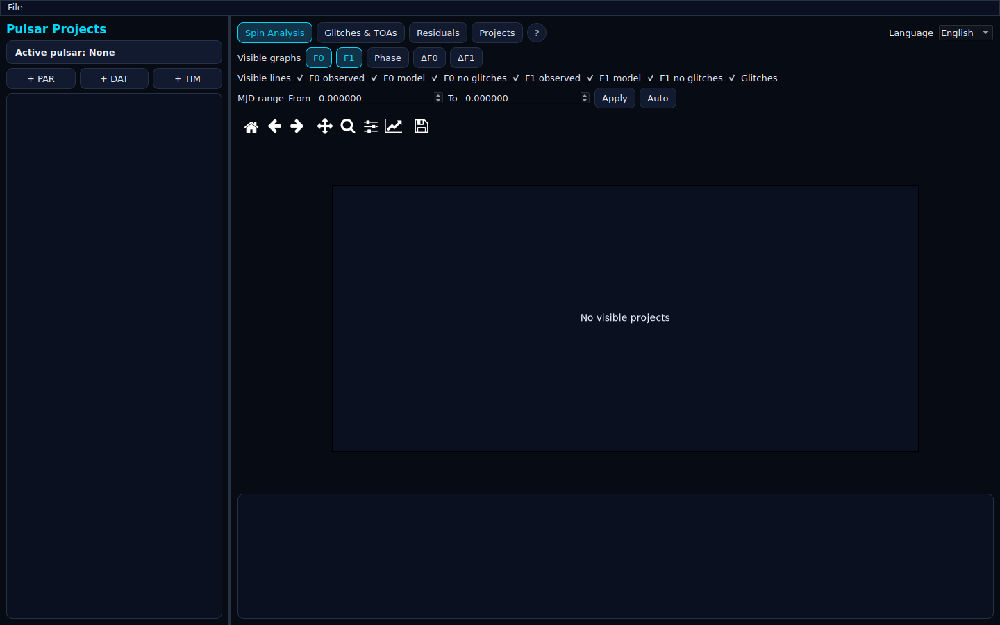

# PulsarLab

*Una plataforma científica de escritorio y headless para evolución de spin de púlsares, modelado de glitches y análisis de contexto de TOAs.*

**[Read in English](README.md)**



**Versión pública actual: 1.0.0**

## Lo destacado

- Carga archivos PAR, DAT y TIM **de forma independiente y en cualquier orden** — no necesitas tener los tres para empezar a trabajar.
- Calcula la evolución de spin (F0, F1, F2), la fase integrada, y los términos de glitch permanentes/exponenciales a partir de un modelo de temporización estilo TEMPO/TEMPO2.
- Residuales de frecuencia procesados (observado − modelo) y análisis de contexto de TOAs (conteos, llegada más cercana, incertidumbre) alrededor de cada época de glitch.
- Un solo comando para verificar que todo funciona: `plab --selfcheck`.
- Validación cruzada opcional contra `pint-pulsar` (PINT) cuando quieras una segunda opinión sobre tus resultados.
- Interfaz bilingüe (inglés/español) de fábrica.

## Descripción general

PulsarLab es una herramienta científica para trabajar con datos de temporización de púlsares: ajustar e inspeccionar un modelo de evolución de spin, modelar glitches, calcular residuales de frecuencia procesados, y poner en contexto los datos de TOA (Time of Arrival / tiempos de llegada) alrededor de eventos de glitch. Corre como una aplicación de escritorio PySide6 (`plab`) o de forma headless, de modo que el mismo núcleo de cómputo se puede scriptear o verificar sin abrir una ventana.

El núcleo científico es intencionalmente NumPy-first y libre de interfaz — la interfaz solo renderiza números que el motor ya calculó. Hay un puente opcional a [PINT](https://github.com/nanograv/PINT) disponible para validación cruzada independiente, pero PulsarLab no depende de él para el uso del día a día.

### Autoría

Construido y mantenido por el equipo de PulsarLab.

## Uso

Abrir un espacio de trabajo vacío:

```bash
plab
```

Cargar cualquier combinación inicial, en cualquier orden:

```bash
plab modelo.par
plab observaciones.dat modelo.par
plab llegadas.tim modelo.par observaciones.dat
```

Se pueden agregar más archivos desde la interfaz una vez abierta. La línea de comandos acepta como máximo un archivo inicial de cada tipo.

Ejecutar una autoverificación headless (útil en CI o para confirmar que la instalación funciona, sin necesidad de ventana):

```bash
plab --selfcheck
```

### Combinaciones de proyecto soportadas

| PAR | DAT | TIM | Resultado |
|---|---|---|---|
| Sí | No | No | Modelo completo, fase, spin y cálculo de glitches |
| No | Sí | No | Observaciones procesadas almacenadas, no computable hasta adjuntar un PAR |
| No | No | Sí | TOAs almacenados y visualizados, no computable hasta adjuntar un PAR |
| Sí | Sí | No | Modelo más residuales de frecuencia procesados |
| Sí | No | Sí | Modelo más análisis de contexto de glitches y TOAs |
| Sí | Sí | Sí | Flujo de trabajo completo |

## Instalación

Se requiere Python 3.10 o superior. Se recomienda usar un entorno virtual.

### Windows

```bash
python -m venv .venv
.venv\Scripts\activate
pip install -r requirements-win.txt
pip install -e .
```

### Linux

```bash
python3 -m venv .venv
source .venv/bin/activate
pip install -r requirements-linux.txt
pip install -e .
```

Un escritorio Linux mínimo puede necesitar además las librerías de sistema Qt/XCB que requiere PySide6.

### macOS

```bash
python3 -m venv .venv
source .venv/bin/activate
pip install -r requirements-macos.txt
pip install -e .
```

Usa una compilación de Python nativa para la arquitectura del Mac.

### Extras opcionales

Validación cruzada contra PINT (agrega Astropy y `pint-pulsar` — puentes de validación, no reemplazos del núcleo de producción NumPy-first):

```bash
pip install -r requirements-validation.txt
```

Backend de graficado opcional más rápido (PyQtGraph):

```bash
pip install -r requirements-fastplot.txt
```

Este repositorio incluye tanto la aplicación de escritorio como el material de desarrollo: pruebas, scripts, documentación, ejemplos y archivos de empaquetado. Los usuarios finales solo necesitan la aplicación instalada o las dependencias de ejecución; quienes desarrollen pueden usar el repositorio completo para pruebas, validación, benchmarks y construcción de la aplicación de escritorio.

## Alcance científico

PulsarLab calcula:

- F0, F1, F2, y la fase integrada a partir de un modelo de temporización.
- Términos de glitch permanentes y exponenciales después de cada GLEP, incluyendo múltiples componentes que comparten una misma época.
- Residuales de frecuencia procesados a partir de los valores DAT como observado menos modelo.
- Fase de TOA y frecuencia instantánea del modelo en las épocas TIM.
- Conteos de TOAs, conteos antes/después, llegada más cercana, y resúmenes de incertidumbre alrededor de cada evento de glitch físico.

PulsarLab no afirma que su proxy de pulso más cercano sea un residual de temporización barycéntrico completo — los residuales de PINT se reportan por separado, a través del puente de validación opcional (`pulsarlab.validation_pint`, `compare_with_pint(par_path, tim_path)`), una vez que `pint-pulsar` está instalado.

### Soporte del formato TIM

El parser soporta la fila común TEMPO2 FORMAT 1:

```text
nombre frecuencia_MHz MJD incertidumbre_us observatorio [flags...]
```

Las flags numéricas reconocidas incluyen `-pn` para número de pulso y `-phase`/`-padd` para desplazamiento de fase. Otras flags se conservan como pares clave/valor. Las directivas se retienen como metadatos; las directivas `INCLUDE` se reportan pero no se expanden automáticamente. Las incertidumbres de TOA permanecen en microsegundos en la tabla parseada — la conversión a segundos está centralizada en `pulsarlab/core/units.py`.

## Estructura del proyecto

```text
pulsarlab/
  core/            física, unidades, tipos científicos inmutables
  parsers/         parseo de PAR, DAT y TIM
  datasets/        proyectos con componentes opcionales y su gestor
  engine/          modelo cacheado, residuales y análisis de TOA
  visualization/   renderizado exclusivamente con Matplotlib
  ui/              aplicación PySide6
  i18n/            strings de interfaz en inglés y español
  cli/             punto de entrada de línea de comandos
requirements*.txt  base, alias por plataforma y herramientas opcionales
```

## Comentarios y contribuciones

¿Encontraste un error, una traducción faltante, o algo que no coincide con la física? Repórtalo con los pasos para reproducirlo — es lo más útil que puedes incluir. Las sugerencias sobre la interfaz, la traducción al español, o la documentación son igual de bienvenidas.

## Licencia

PulsarLab 1.0.0 se distribuye bajo el aviso de derechos incluido en [`LICENSE`](LICENSE).
